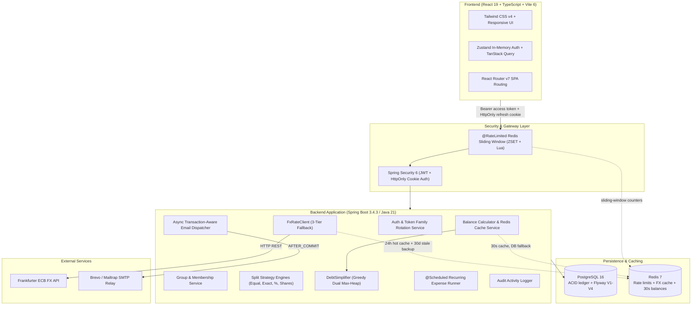

# Settl. — Smart Expense Splitting & Personal Finance Engine

[](https://openjdk.org/)
[](https://spring.io/projects/spring-boot)
[](https://www.postgresql.org/)
[](https://redis.io/)
[](https://react.dev/)
[](https://www.typescriptlang.org/)
[](https://vitejs.dev/)
[](https://tailwindcss.com/)
[](https://opensource.org/licenses/MIT)

**Settl** is a full-stack expense sharing and personal finance platform for groups, roommates, travelers, and individuals. It replaces tangled pairwise debts with a greedy **$O(N \log N)$ dual max-heap debt simplification algorithm** (at most $N - 1$ payments per group), converts multi-currency expenses at write time through a **3-tier resilient FX engine**, schedules **recurring expenses**, and protects sessions with **rotating refresh tokens, breach detection, and Redis-backed rate limiting**.

<!-- Add a hero screenshot or short demo GIF here, plus a live demo link if deployed. -->

---

## 📋 Table of Contents
1. [30-Second Overview for Engineers & Recruiters](#-30-second-overview-for-engineers--recruiters)
2. [Core Concepts & Financial Mathematics](#-core-concepts--financial-mathematics)
   - [Debt Simplification Algorithm](#1-debt-simplification-algorithm-greedy-max-heap)
   - [Split Strategies & Penny-Exact Allocation](#2-flexible-split-strategies--penny-exact-allocation)
   - [3-Tier Resilient Multi-Currency (FX) Engine](#3-3-tier-resilient-multi-currency-fx-engine)
   - [Personal Budgeting & Expense Tracking](#4-personal-budgeting--expense-tracking)
   - [Automated Recurring Expenses](#5-automated-recurring-expenses)
   - [Unregistered Member Invitations](#6-unregistered-guest--member-invitations)
3. [Performance Engineering](#-performance-engineering)
4. [System Architecture](#-system-architecture)
5. [Technology Stack](#-technology-stack)
6. [Security Architecture & Resilience](#-security-architecture--resilience)
7. [API at a Glance](#-api-at-a-glance)
8. [Local Development Setup](#-local-development-setup)
9. [Production Deployment](#-production-deployment)
10. [Testing & Quality Assurance](#-testing--quality-assurance)
11. [Known Limitations & Architectural Trade-offs](#-known-limitations--architectural-trade-offs)
12. [Roadmap](#-roadmap)
13. [Credits & Acknowledgements](#-credits--acknowledgements)
14. [License](#-license)

---

## ⚡ 30-Second Overview for Engineers & Recruiters

- **Algorithmic Debt Simplification**: Greedy dual max-heap matching compresses $N$-party debts into at most $N - 1$ payments in $O(N \log N)$. Backed by randomized property tests (zero-sum conservation and the payment-count bound).
- **Resilient Multi-Currency (FX)**: Write-time conversion using European Central Bank (ECB) rates via the Frankfurter API, with a fallback chain of *Redis 24h hot cache* $\rightarrow$ *live API* $\rightarrow$ *Redis stale backup* $\rightarrow$ *hardcoded baseline table*. Banker's Rounding (`HALF_EVEN`) avoids cumulative rounding drift.
- **Security & Session Hardening**: Access tokens are kept in memory only (Zustand state, never written to web storage), single-use rotating refresh tokens live in `HttpOnly` cookies, token-family reuse detection (`TOKEN_REUSE_DETECTED`) revokes stolen sessions, and an atomic Redis Sorted Set (`ZSET`) sliding window rate-limits login, registration, verification resend, and invitations.
- **Transaction-Aware Async Email**: Verification and invitation emails are sent asynchronously and only **after commit** (`@TransactionalEventListener(phase = AFTER_COMMIT)`), so users never get a link to data that was rolled back or not yet visible.
- **Graceful Redis Degradation**: If Redis is slow or down, balance reads fall back to PostgreSQL aggregate queries and rate limiters fail open with warning logs, so the app stays available.
- **Query-Efficient by Design**: Group balances, expense lists, group listings, and personal analytics were refactored from N+1 patterns to constant-query aggregates, backed by composite and partial indexes (see [Performance Engineering](#-performance-engineering)).
- **Comprehensive Test Suite**: 270+ unit, integration, and security tests covering Flyway migrations, concurrency, scheduler idempotency, Redis failure modes, and split invariants.

---

## 🧮 Core Concepts & Financial Mathematics

### 1. Debt Simplification Algorithm (Greedy Max-Heap)

When members log expenses paid for one another, the raw pairwise debts turn into a tangle of chains and, sometimes, outright cycles (A owes B, B owes C, C owes A).

Settl first collapses everything into each member's **net balance** (total paid minus total owed, with settlements applied). It then runs a **greedy dual max-heap matching**:

1. Put every debtor in one max-heap and every creditor in another.
2. Pop the largest debtor and the largest creditor, and record a payment of `min(debt, credit)`.
3. Push whoever still has a remainder back onto its heap, and repeat until both heaps are empty.

Every step fully settles at least one person, so a group of $N$ members needs **at most $N - 1$ payments**.

**Worked example** — four raw debts: Bob→Alice \$40, Bob→Charlie \$30, Charlie→David \$10, David→Alice \$60.

```
COMPLEX PEER DEBTS (4 payments)          SETTL SIMPLIFIED (3 payments)

┌─────────┐   $40   ┌─────────┐          ┌─────────┐   $70   ┌─────────┐
│   Bob   ├────────►│  Alice  │          │   Bob   ├────────►│  Alice  │
└────┬────┘         └────▲────┘          └─────────┘         └────▲────┘
     │ $30               │ $60                                    │ $30
     ▼                   │                                        │
┌─────────┐   $10   ┌────┴────┐          ┌─────────┐   $20   ┌────┴────┐
│ Charlie ├────────►│  David  │          │ Charlie │◄────────┤  David  │
└─────────┘         └─────────┘          └─────────┘         └─────────┘
```

Net balances (positive = is owed money, negative = owes money):

| Member | Calculation | Net balance |
|---|---|---|
| Alice | +40 + 60 | **+\$100** (creditor) |
| Bob | −40 − 30 | **−\$70** (debtor) |
| Charlie | +30 − 10 | **+\$20** (creditor) |
| David | +10 − 60 | **−\$50** (debtor) |

The balances sum to exactly zero, and the greedy matching proceeds as follows:

1. Largest debtor Bob (−70) meets largest creditor Alice (+100) → **Bob pays Alice \$70**. Alice still has +30.
2. Largest debtor David (−50) meets largest creditor Alice (+30) → **David pays Alice \$30**. David still owes 20.
3. David (−20) meets Charlie (+20) → **David pays Charlie \$20**. Everyone is at \$0.00.

#### Complexity & Guarantees
- **Time**: $O(N \log N)$ — building each heap is $O(N)$, and the matching performs at most $N - 1$ steps, each with $O(\log N)$ heap operations.
- **Space**: $O(N)$ for the debtor and creditor priority queues.
- **Zero-sum invariant**: Net balances always sum to zero, each payment preserves that, and after the last payment every balance is exactly $0.00$.
- **Bounded, not provably minimal**: The greedy approach guarantees at most $N - 1$ payments but does not always find the absolute minimum count. Finding the true minimum is NP-hard (it requires partitioning the group into the maximum number of zero-sum subsets), so Settl trades guaranteed minimality for predictable $O(N \log N)$ performance.
- **Verification**: Randomized property tests check zero-sum conservation and the $N - 1$ payment bound on random groups.
- **Implementation**: [`DebtSimplifier.java`](backend/src/main/java/com/settl/backend/settlement/simplifier/DebtSimplifier.java)

---

### 2. Flexible Split Strategies & Penny-Exact Allocation

Settl supports four split strategies with penny-exact precision using Java `BigDecimal`:

1. **Equal Split**: Divides the expense evenly among selected members. Leftover pennies from non-divisible amounts (e.g. $100.00 among 3 people $\rightarrow$ 33.34, 33.33, 33.33) are assigned deterministically to the payer, so the **sum of shares always equals the total**.
2. **Exact Split**: Each participant is assigned a specific amount, verified server-side to match the total to the cent.
3. **Percentage Split**: Members specify percentages that must total exactly $100.00\%$. Remainder pennies from rounding are absorbed deterministically.
4. **Shares Split**: Split by unit proportions (e.g., 2 parts to Alice, 1 part to Bob).

Split calculation uses the Strategy pattern, so adding a new split type means adding one class rather than editing existing logic.

---

### 3. 3-Tier Resilient Multi-Currency (FX) Engine

Users can log expenses in 30+ ISO-4217 currencies (e.g., EUR, GBP, JPY, CAD, INR) while settling in the group's base currency. Conversion happens **at write time**, so historical expenses never change when exchange rates move.

```
[ Expense Logged in EUR ]
          │
          ▼
┌─────────────────────────────────┐
│ Tier 1: Redis 24h Hot Cache     │ ──(Cache Hit)──► Return Rate
└────────────────┬────────────────┘
                 │ (Cache Miss / Expired)
                 ▼
┌─────────────────────────────────┐
│ Live Frankfurter ECB API        │ ──(200 OK)────► Cache in Redis (24h) & Return Rate
│ (primary source of truth)       │
└────────────────┬────────────────┘
                 │ (API Timeout / 5xx Error)
                 ▼
┌─────────────────────────────────┐
│ Tier 2: Redis Stale Backup (30d)│ ──(Found)─────► Return Last Known Good Rate
└────────────────┬────────────────┘
                 │ (Redis Down / Empty)
                 ▼
┌─────────────────────────────────┐
│ Tier 3: Hardcoded Baseline Table│ ──────────────► Return Offline Baseline Rate
└─────────────────────────────────┘
```

- **Banker's Rounding**: Uses `RoundingMode.HALF_EVEN` to avoid cumulative rounding bias across many converted transactions.
- **Input validation**: Currency codes are validated in a single shared `CurrencyValidator` used by every service and DTO.

---

### 4. Personal Budgeting & Expense Tracking

In addition to group splitting, Settl includes a **Personal Finance Tracker**:
- Log personal, non-group expenses by category: Food, Transportation, Housing, Entertainment, Utilities, Healthcare, and Shopping.
- Spending analytics with Recharts donut diagrams and monthly trend charts. Aggregation runs in PostgreSQL, and totals are **reported per currency** so amounts in different currencies are never summed together.
- Privacy: Personal transactions are never visible to group members or included in group balance calculations.

---

### 5. Automated Recurring Expenses

- Set up recurring group expenses (daily, weekly, monthly, or yearly) for rent, subscriptions, and utilities.
- An idempotent background scheduler (`@Scheduled`) runs daily at 00:00 UTC and generates due expense records without duplicates.
- Recurring expenses currently use the **equal split** only. Other split types are rejected at creation time (`UNSUPPORTED_SPLIT_TYPE`) rather than silently turned into equal splits.

---

### 6. Unregistered Guest & Member Invitations

- Invite roommates or friends to a group by email before they have a Settl account.
- Invitees receive a secure, expiring token link (see `V2__group_invitations.sql`). Accepting requires being logged in **as the invited email address**, so a leaked link cannot be used by someone else (`INVITATION_EMAIL_MISMATCH`).
- When a new user verifies their email, all pending invitations for that address are claimed automatically.

---

## 🚄 Performance Engineering

The app was profiled and refactored for query efficiency:

| Area | Before | After |
|---|---|---|
| **Group balances** | 4 queries per member (e.g. ~120 queries for a 30-member group) | 4 group-wide `GROUP BY` aggregate queries, constant regardless of group size |
| **Group deletion safety check** | Per-member balance calculation | Reuses the same aggregate balances |
| **Group expense list** | Unbounded list with lazy-loading N+1 on shares | Paginated (`page`, `size`); one page query plus one batched query for that page's shares |
| **User's group list** | One member query per group | One member query for all groups |
| **Personal analytics** | All expenses loaded into memory and summed in Java | Totals, category and monthly breakdowns computed in PostgreSQL |
| **Balance reads** | Recomputed on every request | 30-second Redis cache, evicted after commit on every balance-changing mutation |
| **Writes** | One INSERT per share | JDBC batching (`batch_size=25`, ordered inserts/updates) |
| **Emails** | Sent inside the request thread | Async on a bounded thread pool, after commit |
| **Indexes** | Single-column indexes | Composite and partial indexes for balance, settlement, personal-expense, token, and audit-log queries (`V4__optimize_indexes.sql`) |

Housekeeping: a daily scheduler purges expired refresh tokens (revoked-but-unexpired tokens are kept for reuse detection), and HikariCP uses keepalive and leak detection to surface slow queries.

---

## 🏗️ System Architecture



---

## 🧰 Technology Stack

| Layer | Technology | Details & Rationale |
|---|---|---|
| **Backend** | Java 21 (Temurin) + Spring Boot 3.4.3 | REST architecture with strong typing for financial computations. |
| **Security** | Spring Security 6 + JJWT 0.12.6 | JWT authentication, rotating single-use refresh tokens with breach detection, BCrypt hashing (strength 12). |
| **Database** | PostgreSQL 16 + Flyway 10 | ACID relational integrity, versioned migrations, composite and partial indexes (`V1`–`V4`). |
| **Caching & Limiting** | Redis 7 + Lettuce | Atomic `ZSET` sliding-window rate limiter, 24h FX cache, 30s group balance cache. |
| **Connection Pool** | HikariCP 5.1.0 | JDBC pooling with keepalive (60s) and leak detection (30s). |
| **ORM & Batching** | Hibernate 6.6 / Spring Data JPA | JDBC write batching (`batch_size=25`), batch fetching (`batch_fetch_size=50`). |
| **Email Service** | Spring Mail (Brevo / Mailtrap) | Async dispatch via `@TransactionalEventListener(AFTER_COMMIT)` on a bounded thread pool. |
| **Frontend** | React 19 + TypeScript 5.9 + Vite 6 | Strict compile-time typing with fast HMR. |
| **State Management** | TanStack Query v5 + Zustand 5 | Server-state caching; in-memory (non-persisted) auth state. |
| **Styling & UI** | Tailwind CSS v4 + Lucide React | Dark/light theme, accessible 44px+ tap targets. |
| **Charts & Graphs** | Recharts 3.x | Category donut charts and monthly spending trends. |
| **Documentation** | SpringDoc OpenAPI 2.8 + Swagger UI | Interactive API docs at `/swagger-ui/index.html` (disabled in the `prod` profile). |
| **Containerization** | Docker & Docker Compose | Multi-stage builds with Alpine JRE and Nginx static delivery. |

---

## 🔒 Security Architecture & Resilience

- **Access Token Handling**: Short-lived access tokens (15 minutes) live only in memory (Zustand state) and are never written to `localStorage` or `sessionStorage`. This removes them from persistent storage, but it is not a substitute for XSS prevention.
- **Refresh Cookies**: 7-day refresh tokens are stored in `HttpOnly`, `SameSite=Strict` cookies that JavaScript cannot read. The `Secure` flag is controlled by the `SECURE_COOKIES` setting (on by default in the `prod` profile) and cookie attributes are built in one place (`CookieFactory`).
- **Token Family Breach Detection**: Refresh tokens rotate on every use. If a previously consumed token is replayed (a sign of theft), the whole token family is revoked and the request fails with `401 TOKEN_REUSE_DETECTED`.
- **Hashed Tokens at Rest**: Refresh and email-verification tokens are stored as SHA-256 hashes, never in plaintext.
- **Rate Limiting**: A Redis `ZSET` Lua script enforces sliding-window limits and returns `429` with `Retry-After`. Current limits: login 5/min (per IP and per email), registration and verification resend 3/hour per IP, group invitations 20/hour, account deletion limited as well.
- **Invitation Ownership**: Accepting an invitation requires the logged-in user's email to match the invited address.
- **Safe Account Deletion**: Deleting an account clears the refresh cookie and scrubs personal data (PII) while preserving shared expense history for other group members.
- **Transaction-Aware Email**: Emails are sent only after the database transaction commits, so there are no phantom emails after rollbacks.
- **Method-Level Authorization**: `@PreAuthorize` group-membership checks and creator-only controls on expense modification and deletion.
- **Input Safety**: Parameterized JPA/Hibernate queries only, plus Jakarta Bean Validation on all request bodies (amounts must be positive with at most two decimal places).
- **Production Hardening**: Swagger UI and OpenAPI docs are disabled under the `prod` profile.

---

## 🔌 API at a Glance

Full interactive documentation is available in Swagger UI when running locally. Selected endpoints:

| Endpoint | Purpose | Notes |
|---|---|---|
| `POST /api/auth/register` | Create an account | Rate limited |
| `POST /api/auth/login` | Log in | Rate limited by IP and email |
| `POST /api/auth/resend-verification` | Resend the verification email | Rate limited |
| `POST /api/invitations/accept?token=…` | Accept a group invitation | Must be logged in as the invited email |
| `GET /api/groups/{id}/balances` | Net balance per member and simplified payments | Cached for 30s |
| `GET /api/groups/{groupId}/expenses?page=0&size=20` | Paginated group expenses | `size` is clamped to 1–100 |
| `GET /api/groups/{groupId}/settlements?page=0&size=20` | Paginated settlements | Same paging rules |
| `POST /api/groups/{groupId}/recurring-expenses` | Create a recurring expense | `splitType` must be `EQUAL` |
| `GET /api/expenses/personal/analytics` | Personal spending analytics | Per-currency sections; optional `?currency=USD` |
| `DELETE /api/users/me` | Delete the account | Rate limited |

---

## 🚀 Local Development Setup

For detailed step-by-step instructions, see [`SETUP.md`](SETUP.md).

### Quickstart (Hybrid Setup: Docker Infrastructure + Local Apps)

1. **Start PostgreSQL & Redis with Docker**:
   ```bash
   docker compose up -d postgres redis
   ```
   *(PostgreSQL runs on port `5435` to avoid conflicts with a local Postgres; Redis runs on `6379`).*

2. **Configure Backend Environment**:
   ```bash
   cd backend
   cp .env.example .env
   ```
   *(Ensure `DB_URL` points to port `5435`: `jdbc:postgresql://localhost:5435/expense_splitter?options=-c%20timezone=UTC`). See `.env.example` for the full list of variables.*

3. **Start Spring Boot Backend**:
   ```bash
   # On Windows
   .\mvnw.cmd spring-boot:run

   # On Linux/macOS
   ./mvnw spring-boot:run
   ```
   *Backend is live on `http://localhost:8080` (Swagger UI: `http://localhost:8080/swagger-ui/index.html`). Flyway applies migrations `V1`–`V4` automatically on startup.*

4. **Start Frontend Dev Server**:
   ```bash
   cd ../frontend
   npm install
   npm run dev
   ```
   *Frontend is live on `http://localhost:5173` (automatically proxies `/api` to port 8080)*.

---

## 🐳 Production Deployment

### Option 1: Full-Stack Docker Compose
```bash
docker compose up --build -d
```
Spins up all 4 production containers:
- `settl-postgres-prod`: PostgreSQL 16 Alpine with persistent data volume.
- `settl-redis-prod`: Redis 7 Alpine with persistent append-only storage.
- `settl-backend-prod`: Multi-stage Eclipse Temurin 21 JRE Alpine image.
- `settl-frontend-prod`: Multi-stage Nginx Alpine container serving optimized Vite assets with reverse-proxying for `/api`.

### Option 2: Cloud Decoupled PaaS
- **Database**: Managed PostgreSQL 16 on [Supabase](https://supabase.com/), [Neon](https://neon.tech/), or AWS RDS.
- **Cache**: Managed Redis on [Upstash](https://upstash.com/) or AWS ElastiCache.
- **Backend**: Container service on [Railway](https://railway.app/), [Render](https://render.com/), or AWS ECS using [`backend/Dockerfile`](backend/Dockerfile).
- **Frontend**: Static SPA on [Vercel](https://vercel.com/) or [Netlify](https://netlify.com/) using `frontend/vercel.json` for SPA rewrites.

> **Cookie note for split hosting:** refresh tokens use `SameSite=Strict` cookies, which browsers do not send on cross-site requests. If the frontend and API are on different sites (for example `*.vercel.app` and `*.railway.app`), either serve both under one registrable domain or have the frontend host proxy `/api` to the backend; otherwise token refresh will fail.

### Production Checklist
- Run with the `prod` profile (`SPRING_PROFILES_ACTIVE=prod`) and confirm `SECURE_COOKIES=true`; terminate TLS in front of the app.
- Make sure the reverse proxy forwards the real client IP (`X-Forwarded-For`) so IP-based rate limits apply per user, not per proxy.
- Take a database backup before upgrading an existing deployment. Flyway runs on startup, and `V3` normalizes any legacy recurring-expense split types to `EQUAL`.
- Provide production values for the JWT signing secret, SMTP credentials, and database/Redis URLs through environment variables, never committed files.

---

## 📊 Testing & Quality Assurance

Settl includes an extensive automated test suite:

```bash
cd backend
./mvnw test
```

```text
[INFO] Results:
[INFO] 
[INFO] Tests run: 272, Failures: 0, Errors: 0, Skipped: 0
[INFO] 
[INFO] BUILD SUCCESS
```

- **Randomized Invariant Tests**: 50 iterations verifying $N$-member zero-sum balance conservation and the $N - 1$ payment bound.
- **Scheduler Idempotency Tests**: Verify recurring-expense jobs never double-bill or run duplicates.
- **Security & Token Rotation Tests**: Simulate token replay attacks and verify immediate invalidation of compromised token families.
- **Authorization Tests**: Cover invitation ownership, creator-only expense changes, and rate-limit responses (`429`).
- **Redis Resilience & Fallback Tests**: Assert that requests succeed without hanging when Redis times out or is offline.
- **Repository & Query Tests**: Cover aggregate balance queries, pagination, and query counts that stay constant as groups grow.
- **Frontend Strict TypeScript Check**:
  ```bash
  cd frontend && npm run build
  ```

---

## ⚖️ Known Limitations & Architectural Trade-offs

Building a financial system involves deliberate trade-offs between performance, operational simplicity, and strict consistency:

1. **30-Second Cache Staleness Window (`group_balances`)**:
   - *Current Design*: Group balances are cached in Redis under `group_balances:{groupId}` with a 30-second TTL. Balance-changing operations evict the entry *after commit*.
   - *Trade-off*: If the eviction call fails (for example during a brief Redis blip), or a concurrent read lands just before a commit and repopulates the cache, a stale value can be served until the TTL expires, at most 30 seconds. If Redis is fully down, reads bypass the cache and use PostgreSQL.
   - *Scale Evolution*: At higher scale with multiple regions or replicas, move to distributed invalidation via Redis Pub/Sub or Change Data Capture (Debezium + Kafka).
2. **Migration Indexing (`CREATE INDEX` vs. `CONCURRENTLY`)**:
   - *Current Design*: Flyway runs standard `CREATE INDEX` at startup.
   - *Trade-off*: A standard index build blocks writes to the table while it runs. That is negligible at current data sizes.
   - *Scale Evolution*: On very large tables, create indexes out-of-band with `CREATE INDEX CONCURRENTLY` (which cannot run inside Flyway's default transaction).
3. **Redis Rate Limiter Fails Open**:
   - *Current Design*: If Redis is unreachable or slow, the `@RateLimited` interceptor allows the request and logs a warning instead of returning `503`.
   - *Trade-off*: Prioritizes availability over strict throttling during an outage. BCrypt (cost 12, a few hundred milliseconds per hash) still slows password guessing, but that is only a partial defense against parallel attacks.
   - *Scale Evolution*: Add an in-process fallback limiter (Caffeine / Bucket4j) or enforce limits at the edge (Cloudflare / AWS WAF).
4. **Stateless Access Tokens**:
   - *Trade-off*: A JWT stays valid until it expires (15 minutes) even after logout or account deletion. Refresh tokens, however, are revoked immediately.
   - *Scale Evolution*: Add a short-lived token denylist in Redis if immediate revocation is required.
5. **Recurring Expenses Are Equal-Split Only**:
   - *Trade-off*: Supporting exact, percentage, or shares splits would require storing per-participant split parameters for each template, so these types are rejected up front.
6. **FX Rates Are Locked at Write Time**:
   - *Trade-off*: Historical expenses stay stable, but they reflect the rate at the time of entry. The Tier 3 hardcoded baseline can be out of date if both the live API and the Redis backups are unavailable.
7. **Personal Analytics Are Per-Currency**:
   - *Trade-off*: Totals are never summed across currencies, so there is no single "grand total" for users with mixed-currency expenses.
8. **In-Process Schedulers**:
   - *Trade-off*: The recurring-expense and token-cleanup jobs run inside each backend instance. Before running multiple replicas, add a distributed lock (for example ShedLock) to avoid redundant executions.

---

## 🔭 Roadmap

- Per-participant split parameters for recurring expenses (exact, percentage, shares).
- Distributed scheduler locking for horizontally scaled deployments.
- Redis-backed access-token denylist for instant session revocation.
- Local fallback rate limiter for Redis outages.
- Optional cross-currency totals using stored conversion rates.

---

## 👏 Credits & Acknowledgements

- **[Frankfurter API](https://frankfurter.dev/)**: Open-source foreign exchange reference rates published by the European Central Bank.
- **[Lucide Icons](https://lucide.dev/)**: Clean, modern icons for navigation and UI elements.
- **[Spring Framework & Spring Boot](https://spring.io/)**: The foundation of the Java backend.
- **[Tailwind CSS](https://tailwindcss.com/) & [Recharts](https://recharts.org/)**: Responsive styling and data visualization.

---

## 📄 License

This project is licensed under the **MIT License**.

```text
MIT License

Copyright (c) 2026 Om Biswas

Permission is hereby granted, free of charge, to any person obtaining a copy
of this software and associated documentation files (the "Software"), to deal
in the Software without restriction, including without limitation the rights
to use, copy, modify, merge, publish, distribute, sublicense, and/or sell
copies of the Software, and to permit persons to whom the Software is
furnished to do so, subject to the following conditions:

The above copyright notice and this permission notice shall be included in all
copies or substantial portions of the Software.

THE SOFTWARE IS PROVIDED "AS IS", WITHOUT WARRANTY OF ANY KIND, EXPRESS OR
IMPLIED, INCLUDING BUT NOT LIMITED TO THE WARRANTIES OF MERCHANTABILITY,
FITNESS FOR A PARTICULAR PURPOSE AND NONINFRINGEMENT. IN NO EVENT SHALL THE
AUTHORS OR COPYRIGHT HOLDERS BE LIABLE FOR ANY CLAIM, DAMAGES OR OTHER
LIABILITY, WHETHER IN AN ACTION OF CONTRACT, TORT OR OTHERWISE, ARISING FROM,
OUT OF OR IN CONNECTION WITH THE SOFTWARE OR THE USE OR OTHER DEALINGS IN THE
SOFTWARE.
```