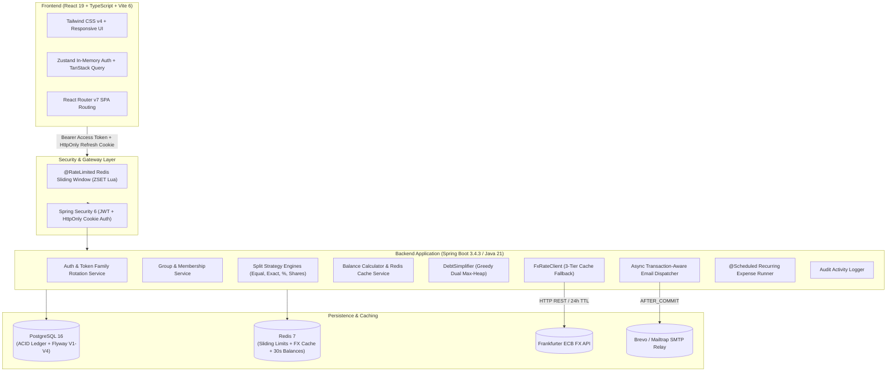

# Settl. — Smart Expense Splitting & Personal Finance Engine

[](https://openjdk.org/)
[](https://spring.io/projects/spring-boot)
[](https://www.postgresql.org/)
[](https://redis.io/)
[](https://react.dev/)
[](https://www.typescriptlang.org/)
[](https://vitejs.dev/)
[](https://tailwindcss.com/)
[](https://opensource.org/licenses/MIT)

**Settl** is an enterprise-grade full-stack expense sharing and personal finance tracking platform built for groups, roommates, travelers, and individuals. It replaces convoluted, circular debts with an optimal **$O(N \log N)$ Greedy Dual Max-Heap Debt Simplification Algorithm**, real-time **Multi-Currency FX Conversion** with a 3-tier resilient caching engine, automated **recurring expense scheduling**, and an enterprise-grade **security and session architecture**.

---

## 📋 Table of Contents
1. [30-Second Overview for Engineers & Recruiters](#-30-second-overview-for-engineers--recruiters)
2. [Core Concepts & Financial Mathematics](#-core-concepts--financial-mathematics)
   - [Debt Simplification Algorithm](#1-debt-simplification-algorithm-greedy-max-heap)
   - [Split Strategies & Penny-Exact Allocation](#2-flexible-split-strategies--penny-exact-allocation)
   - [3-Tier Resilient Multi-Currency (FX) Engine](#3-3-tier-resilient-multi-currency-fx-engine)
   - [Personal Budgeting & Expense Tracking](#4-personal-budgeting--expense-tracking)
   - [Automated Recurring Expenses](#5-automated-recurring-expenses)
   - [Unregistered Member Invitations](#6-unregistered-guest--member-invitations)
3. [System Architecture](#-system-architecture)
4. [Technology Stack](#-technology-stack)
5. [Security Architecture & Resilience](#-security-architecture--resilience)
6. [Local Development Setup](#-local-development-setup)
7. [Production Deployment](#-production-deployment)
8. [Testing & Quality Assurance](#-testing--quality-assurance)
9. [Known Limitations & Architectural Trade-offs](#-known-limitations--architectural-trade-offs)
10. [Credits & Acknowledgements](#-credits--acknowledgements)
11. [License](#-license)

---

## ⚡ 30-Second Overview for Engineers & Recruiters

- **Algorithmic Debt Simplification**: Custom greedy dual max-heap matching algorithm that compresses complex $N$-party peer debts into a minimal transaction set bounded by $\le N - 1$ transfers. Formally verified via randomized zero-sum mathematical property tests.
- **Resilient Multi-Currency (FX)**: Write-time conversion using European Central Bank (ECB) rates via Frankfurter API with a 3-tier fallback architecture: *Redis 24h Hot Cache* $\rightarrow$ *Redis Stale Backup* $\rightarrow$ *Hardcoded Fallback Table*. Banker's Rounding (`HALF_EVEN`) eliminates cumulative rounding drift.
- **Security & Session Hardening**: Access tokens kept strictly in volatile memory (Zustand state, immune to XSS), rotating single-use refresh tokens stored in `HttpOnly, Secure, SameSite=Strict` cookies, cryptographic token family reuse detection (`TOKEN_REUSE_DETECTED`), and atomic Redis Sorted Set (`ZSET`) sliding-window rate limiting.
- **Async & Transaction-Aware Email Dispatch**: Asynchronous email delivery (verification and group invitations) triggered exclusively **after commit** via `@TransactionalEventListener(phase = AFTER_COMMIT)` to prevent race conditions and rolled-back emails.
- **Graceful Redis Degradation**: In-memory caching and rate limiting gracefully degrade if Redis is slow or unavailable—balance queries transparently fall back to PostgreSQL aggregate calculations, and rate limiters fail open with warning logs.
- **Comprehensive Test Suite**: 270+ unit, integration, and security tests covering Flyway migrations, concurrent race conditions, scheduler idempotency, and split invariant assertions.

---

## 🧮 Core Concepts & Financial Mathematics

### 1. Debt Simplification Algorithm (Greedy Max-Heap)

When members in a group log expenses paid for one another, the resulting pairwise debt graph forms an $O(N^2)$ tangle of circular obligations.

Settl implements a **greedy dual max-heap matching algorithm** that eliminates all cycles and resolves the group's net balances into at most $N - 1$ payments:

```
        COMPLEX PEER DEBTS (5 Transactions)                  SETTL SIMPLIFIED (2 Transactions)
         ┌─────────┐       $40       ┌─────────┐              ┌─────────┐                ┌─────────┐
         │   Bob   ├────────────────►│  Alice  │              │   Bob   ├───────────────►│  Alice  │
         └──┬──────┘                 └────▲────┘              └───┬─────┘     $70        └────▲────┘
            │                             │                       │                           │
        $30 │                             │ $60                   │ $20                       │ $30
            ▼                             │                       ▼                           │
         ┌─────────┐       $10       ┌────┴────┐              ┌─────────┐                     │
         │ Charlie ├────────────────►│  David  │              │  David  ├─────────────────────┘
         └─────────┘                 └─────────┘              └─────────┘
```

#### Mathematical Complexity & Guarantees:
- **Time Complexity**: $O(N \log N)$ — constructing max-heaps in $O(N)$ and performing at most $N-1$ extract/insert operations in $O(\log N)$ time.
- **Space Complexity**: $O(N)$ auxiliary memory for debtor and creditor priority queues.
- **Zero-Sum Invariant**: Total money settled is invariant; every member's balance reaches exactly $0.00$.
- **Implementation**: See [`DebtSimplifier.java`](file:///c:/Users/ombiswas/Projects/Settl/backend/src/main/java/com/settl/backend/settlement/simplifier/DebtSimplifier.java) for complete formal guarantees.

---

### 2. Flexible Split Strategies & Penny-Exact Allocation

Settl supports four split strategies with penny-exact precision using Java `BigDecimal`:

1. **Equal Split**: Evenly divides the expense among selected members. Any remaining remainder pennies from non-divisible amounts (e.g. $100.00 among 3 people $\rightarrow$ 33.34, 33.33, 33.33) are deterministically allocated to the payer or first member so **sum of shares $\equiv$ total expense**.
2. **Exact Split**: Each participant is assigned a specific monetary amount; verified server-side to match the total down to the cent.
3. **Percentage Split**: Members specify percentage distributions ($100.00\%$ total). Remainder pennies from fraction rounding are absorbed deterministically.
4. **Shares Split**: Split by unit proportions (e.g., 2 parts to Alice, 1 part to Bob).

---

### 3. 3-Tier Resilient Multi-Currency (FX) Engine

Users can log expenses in 30+ ISO-4217 currencies (e.g., EUR, GBP, JPY, CAD, INR) while settling in the group's base currency:

```
[ Expense Logged in EUR ]
          │
          ▼
┌─────────────────────────────────┐
│ Tier 1: Redis 24h Hot Cache     │ ──(Cache Hit)──► Return Rate
└────────────────┬────────────────┘
                 │ (Cache Miss / Expired)
                 ▼
┌─────────────────────────────────┐
│ Live Frankfurter ECB API        │ ──(200 OK)────► Cache in Redis (24h) & Return Rate
└────────────────┬────────────────┘
                 │ (API Timeout / 5xx Error)
                 ▼
┌─────────────────────────────────┐
│ Tier 2: Redis Stale Backup (30d)│ ──(Found)─────► Return Last Known Good Rate
└────────────────┬────────────────┘
                 │ (Redis Down / Empty)
                 ▼
┌─────────────────────────────────┐
│ Tier 3: Hardcoded Baseline Table│ ──────────────► Return Verified Offline Rate
└─────────────────────────────────┘
```

- **Banker's Rounding**: Uses `RoundingMode.HALF_EVEN` to eliminate cumulative statistical rounding bias across large numbers of converted transactions.

---

### 4. Personal Budgeting & Expense Tracking

In addition to group splitting, Settl includes a **Personal Finance Tracker**:
- Log personal, non-group expenses categorized into Food, Transportation, Housing, Entertainment, Utilities, Healthcare, and Shopping.
- Real-time spending analytics with interactive Recharts donut diagrams and monthly expenditure trend analysis.
- Total privacy: Personal transactions are never visible to group members or included in group balance calculations.

---

### 5. Automated Recurring Expenses

- Set up recurring payments (daily, weekly, monthly, or yearly) for rent, subscriptions, and utilities.
- An idempotent background scheduler (`@Scheduled`) runs daily at 00:00 UTC, automatically generating group expense records when due without duplicate execution.

---

### 6. Unregistered Guest & Member Invitations

- Invite roommates or friends to a group before they have created a Settl account via email.
- Unregistered users receive a secure cryptographic invitation link (`V2__group_invitations.sql`). Upon registration, all pending group memberships and shared expenses are automatically claimed and linked to their new profile.

---

## 🏗️ System Architecture



---

## 🛠️ Technology Stack

| Layer | Technology | Details & Rationale |
|---|---|---|
| **Backend** | Java 21 (Temurin) + Spring Boot 3.4.3 | High-throughput REST architecture, virtual thread ready, strong typing for financial computations. |
| **Security** | Spring Security 6 + JJWT 0.12.6 | JWT authentication, rotating single-use refresh tokens with breach detection, BCrypt hashing (strength 12). |
| **Database** | PostgreSQL 16 + Flyway 10 | ACID relational integrity, composite & partial indexing (`V1`–`V4`), foreign key cascading. |
| **Caching & Limiting** | Redis 7 + Lettuce | Atomic Redis `ZSET` sliding window rate limiter, 24h FX cache, 30s group balance cache. |
| **Connection Pool** | HikariCP 5.1.0 | Fast JDBC pooling with automated keepalive (60s) and leak detection (30s). |
| **ORM & Batching** | Hibernate 6.6 / Spring Data JPA | JDBC write batching (`batch_size=25`), relationship fetch optimization (`batch_fetch_size=50`). |
| **Email Service** | Spring Mail (Brevo / Mailtrap) | Transaction-synchronized async email dispatch via `@TransactionalEventListener(AFTER_COMMIT)`. |
| **Frontend** | React 19 + TypeScript 5.9 + Vite 6 | Strict compile-time typing matching backend OpenAPI schemas with lightning-fast HMR. |
| **State Management** | TanStack Query v5 + Zustand 5 | Server state caching, in-memory volatile authentication state protecting access tokens from XSS. |
| **Styling & UI** | Tailwind CSS v4 + Lucide React | Modern dark/light theme, accessible 44px+ tap targets, fluid animations. |
| **Charts & Graphs** | Recharts 3.x | Category donut charts, monthly spending trend graphs, debt visualization. |
| **Documentation** | SpringDoc OpenAPI 2.8 + Swagger UI | Interactive API documentation accessible at `/swagger-ui/index.html`. |
| **Containerization** | Docker & Docker Compose | Multi-stage production builds with Alpine JRE and Nginx static delivery. |

---

## 🔒 Security Architecture & Resilience

- **XSS Mitigation**: Short-lived access tokens (15 minutes) are held strictly in memory in Zustand state. Never written to `localStorage` or `sessionStorage`.
- **CSRF & Refresh Security**: 7-day refresh tokens are stored in `HttpOnly, Secure, SameSite=Strict` cookies, completely inaccessible to JavaScript.
- **Token Family Breach Detection**: Refresh tokens are rotated on each use. If a previously consumed token is replayed (indicating token theft), the entire token family is immediately revoked with HTTP `401 TOKEN_REUSE_DETECTED`.
- **Distributed Sliding-Window Rate Limiting**: Redis `ZSET` atomic Lua script enforces rate limits on login (dual IP + email checks), registration, verification resend, and group invitations, returning `HTTP 429` with `Retry-After`.
- **Async & Transaction-Aware Email Dispatch**: Verification and invitation emails are dispatched only **after** the surrounding database transaction commits, preventing race conditions or phantom emails on transaction rollback.
- **Method-Level Authorization**: Enforces strict `@PreAuthorize` group membership and creator-only controls on expense modification and deletion.
- **SQL Injection Prevention**: 100% parameterized JPA/Hibernate queries and Jakarta Bean Validation constraints on all incoming requests.

---

## 🚀 Local Development Setup

For detailed step-by-step instructions, see [`SETUP.md`](file:///c:/Users/ombiswas/Projects/Settl/SETUP.md).

### Quickstart (Hybrid Setup: Docker Infrastructure + Local Apps)

1. **Start PostgreSQL & Redis with Docker**:
   ```bash
   docker compose up -d postgres redis
   ```
   *(PostgreSQL runs on port `5435` to avoid conflicts with local Postgres; Redis runs on `6379`).*

2. **Configure Backend Environment**:
   ```bash
   cd backend
   cp .env.example .env
   ```
   *(Ensure `DB_URL` points to port `5435`: `jdbc:postgresql://localhost:5435/expense_splitter?options=-c%20timezone=UTC`)*.

3. **Start Spring Boot Backend**:
   ```bash
   # On Windows
   .\mvnw.cmd spring-boot:run

   # On Linux/macOS
   ./mvnw spring-boot:run
   ```
   *Backend is live on `http://localhost:8080` (Swagger UI: `http://localhost:8080/swagger-ui/index.html`)*.

4. **Start Frontend Dev Server**:
   ```bash
   cd ../frontend
   npm install
   npm run dev
   ```
   *Frontend is live on `http://localhost:5173` (automatically proxies `/api` to port 8080)*.

---

## 🐳 Production Deployment

### Option 1: Full-Stack Docker Compose
```bash
docker compose up --build -d
```
Spins up all 4 production containers:
- `settl-postgres-prod`: PostgreSQL 16 Alpine with persistent data volume.
- `settl-redis-prod`: Redis 7 Alpine with persistent append-only storage.
- `settl-backend-prod`: Multi-stage Eclipse Temurin 21 JRE Alpine image.
- `settl-frontend-prod`: Multi-stage Nginx Alpine container serving optimized Vite assets with reverse-proxying for `/api`.

### Option 2: Cloud Decoupled PaaS
- **Database**: Managed PostgreSQL 16 on [Supabase](https://supabase.com/), [Neon](https://neon.tech/), or AWS RDS.
- **Cache**: Managed Redis on [Upstash](https://upstash.com/) or AWS ElastiCache.
- **Backend**: Container service on [Railway](https://railway.app/), [Render](https://render.com/), or AWS ECS using [`backend/Dockerfile`](file:///c:/Users/ombiswas/Projects/Settl/backend/Dockerfile).
- **Frontend**: Static SPA on [Vercel](https://vercel.com/) or [Netlify](https://netlify.com/) using `frontend/vercel.json` for SPA rewrites.

---

## 📊 Testing & Quality Assurance

Settl includes an extensive automated test suite:

```bash
cd backend
./mvnw test
```

```text
[INFO] Results:
[INFO] 
[INFO] Tests run: 272, Failures: 0, Errors: 0, Skipped: 0
[INFO] 
[INFO] BUILD SUCCESS
```

- **Randomized Invariant Tests**: 50 iterations verifying $N$-group zero-sum balance conservation and minimal payment bounds.
- **Scheduler Idempotency Tests**: Verifies recurring expense cron jobs never double-bill or execute duplicate runs.
- **Security & Token Rotation Tests**: Simulates token replay attacks and verifies immediate invalidation of compromised token families.
- **Redis Resilience & Fallback Tests**: Asserts that requests succeed without hangs when Redis times out or is offline.
- **Frontend Strict TypeScript Check**:
  ```bash
  cd frontend && npm run build
  ```

---

## ⚖️ Known Limitations & Architectural Trade-offs

Building a production-ready financial system requires deliberate choices between performance, operational simplicity, and strict consistency:

1. **30-Second Cache Staleness Window (`group_balances`)**:
   - *Current Design*: Group balances are cached in Redis under `group_balances:{groupId}` with a 30-second TTL. Balance-mutating operations evict the cache *after commit*.
   - *Trade-off*: In rare edge cases where Redis drops immediately after a commit, stale balances could be served for up to 30s.
   - *Scale Evolution*: At higher scale with multi-region replicas, transition to **Change Data Capture (CDC)** via Debezium + Kafka or Redis Pub/Sub for distributed cache invalidation.
2. **Migration Indexing (`CREATE INDEX` vs. `CONCURRENTLY`)**:
   - *Current Design*: Flyway runs standard `CREATE INDEX` during boot to establish composite indexes.
   - *Trade-off*: Standard indexing acquires a `SHARE` lock on tables.
   - *Scale Evolution*: On large enterprise databases with millions of rows, run migrations out-of-band using `CREATE INDEX CONCURRENTLY` to avoid write locks.
3. **Redis Rate Limiter Fail-Open Resiliency**:
   - *Current Design*: If Redis is unreachable, the `@RateLimited` interceptor **fails open** with a warning log rather than returning HTTP 503.
   - *Trade-off*: Prioritizes user availability over strict rate limiting during cache downtime. Password guessing remains throttled downstream by CPU-intensive BCrypt hashing (cost 12, ~300ms per attempt).
   - *Scale Evolution*: Add an in-process local token bucket fallback (Caffeine / Bucket4j) as a circuit-breaker, or enforce edge rate limiting via Cloudflare / AWS WAF.

---

## 👏 Credits & Acknowledgements

- **[Frankfurter API](https://frankfurter.dev/)**: Reliable, open-source foreign exchange reference rates published by the European Central Bank.
- **[Lucide Icons](https://lucide.dev/)**: Clean, modern icons for financial navigation and UI elements.
- **[Spring Framework & Spring Boot](https://spring.io/)**: For the enterprise-grade Java backend foundation.
- **[Tailwind CSS](https://tailwindcss.com/) & [Recharts](https://recharts.org/)**: For responsive styling and data visualization.

---

## 📄 License

This project is licensed under the **MIT License**.

```text
MIT License

Copyright (c) 2026 Om Biswas

Permission is hereby granted, free of charge, to any person obtaining a copy
of this software and associated documentation files (the "Software"), to deal
in the Software without restriction, including without limitation the rights
to use, copy, modify, merge, publish, distribute, sublicense, and/or sell
copies of the Software, and to permit persons to whom the Software is
furnished to do so, subject to the following conditions:

The above copyright notice and this permission notice shall be included in all
copies or substantial portions of the Software.

THE SOFTWARE IS PROVIDED "AS IS", WITHOUT WARRANTY OF ANY KIND, EXPRESS OR
IMPLIED, INCLUDING BUT NOT LIMITED TO THE WARRANTIES OF MERCHANTABILITY,
FITNESS FOR A PARTICULAR PURPOSE AND NONINFRINGEMENT. IN NO EVENT SHALL THE
AUTHORS OR COPYRIGHT HOLDERS BE LIABLE FOR ANY CLAIM, DAMAGES OR OTHER
LIABILITY, WHETHER IN AN ACTION OF CONTRACT, TORT OR OTHERWISE, ARISING FROM,
OUT OF OR IN CONNECTION WITH THE SOFTWARE OR THE USE OR OTHER DEALINGS IN THE
SOFTWARE.
```
