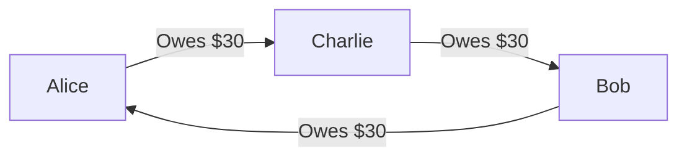
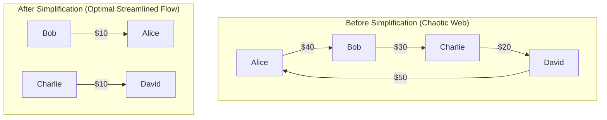

# Debt Simplification Algorithm

## 1. Overview & Problem Statement

In expense-sharing groups (such as trips, roommates, or shared projects), members constantly pay for each other. In a naive model, each expense records pairwise debts directly between individuals. For $N$ participants, this creates up to $\frac{N(N-1)}{2}$ directed debt edges containing complex cycles, redundant transactions, and confusing payment chains.

### The Naive Problem (Cycle / Web):
Suppose **Alice**, **Bob**, and **Charlie** go on a trip:
- Alice pays \$30 for Bob.
- Bob pays \$30 for Charlie.
- Charlie pays \$30 for Alice.

In a naive pairwise model, 3 separate bank transfers would occur, even though everyone's net balance is **\$0.00**.



---

## 2. The Greedy Max-Heap Strategy

The Debt Simplifier eliminates pairwise dependencies by computing each user's **Net Balance**:

$$\text{Net Balance}(u) = \left(\sum \text{Paid By } u - \sum \text{Owed By } u\right) + \left(\sum \text{Settled Paid} - \sum \text{Settled Received}\right)$$

- **Creditors ($\text{Net} > 0$)**: People who are owed money by the group.
- **Debtors ($\text{Net} < 0$)**: People who owe money to the group.
- **Settled ($\text{Net} = 0$)**: Balanced; requires no transactions.

### Conservation Invariant
$$\sum_{u \in \text{Group}} \text{Net Balance}(u) = 0$$

### Algorithm Steps:
1. **Partition**: Push all creditors into a **Max-Heap** (ordered descending by credit) and all debtors into a **Max-Heap** (ordered descending by absolute debt).
2. **Greedy Matching Loop**:
   - Extract the largest creditor $C$ and largest debtor $D$.
   - Compute payment amount $S = \min(C.\text{amount}, D.\text{amount})$.
   - Record a simplified transaction: **$D \xrightarrow{\quad \$S \quad} C$**.
   - Decrement $S$ from both balances:
     - If $C$ has a remaining balance $> 0$, push $C$ back into the Creditors Max-Heap.
     - If $D$ has a remaining balance $> 0$, push $D$ back into the Debtors Max-Heap.
     - If either balance reaches $\$0.00$, that participant is completely resolved and eliminated.
3. **Termination**: The loop terminates when both heaps are empty.

---

## 3. Visual Before & After

```
BEFORE SIMPLIFICATION (Complex Web):
  Alice  --- $40 ---> Bob
  Bob    --- $30 ---> Charlie
  David  --- $50 ---> Alice
  Charlie--- $20 ---> David

NET BALANCES:
  Alice:   +$10 (Creditor)
  Bob:     -$10 (Debtor)
  Charlie: -$10 (Debtor)
  David:   +$10 (Creditor)

AFTER SIMPLIFICATION (Minimal Transactions):
  Bob     --- $10 ---> Alice
  Charlie --- $10 ---> David
```



---

## 4. Complexity & Theoretical Guarantees

| Metric | Naive Pairwise | Settl Debt Simplifier |
| :--- | :--- | :--- |
| **Max Number of Transactions** | $\frac{N(N-1)}{2} = O(N^2)$ | **At most $N - 1$** |
| **Time Complexity** | $O(N^2)$ | **$O(N \log N)$** |
| **Space Complexity** | $O(N^2)$ | **$O(N)$** |

### Proof of $N - 1$ Transaction Bound:
In each iteration of the matching loop, we settle $S = \min(C.\text{amount}, D.\text{amount})$. Because $S$ equals the exact balance of either $C$, $D$, or both, at least one participant is guaranteed to reach a net balance of exactly $\$0.00$ and leave the heap permanently.
For $N$ non-zero participants, at least 1 person is eliminated per transaction. The final transaction simultaneously settles the last creditor and the last debtor. Hence, the algorithm generates at most $N - 1$ transactions.
